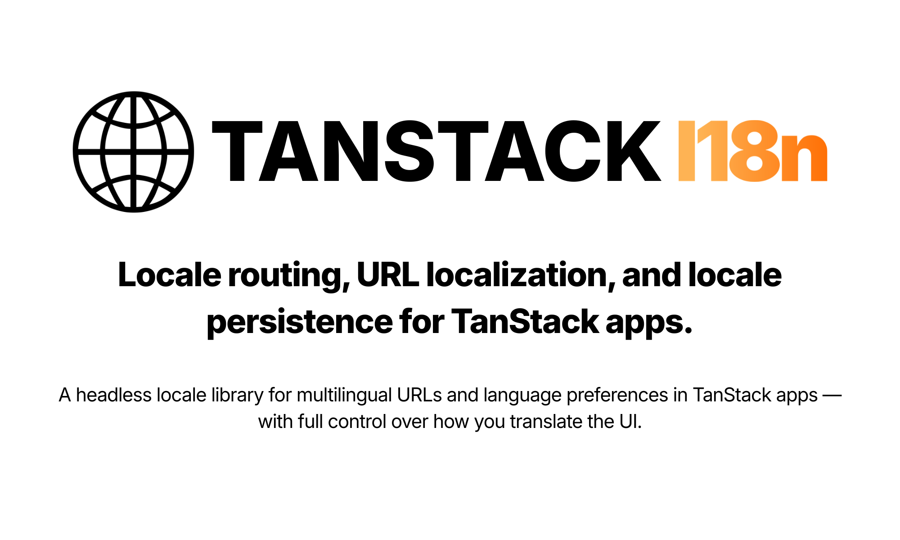

  

  
  =24" />

- Locale segments in URLs — prefix always, hide for default, or custom paths per language
- First-visit handling — send visitors to the right URL and remember their choice
- Browser language detection when no preference exists yet
- React and Solid bindings — bring your own translation library

## Links

- [Documentation](https://tanstack-i18n.wadiou.dev)
- [Package README](packages/tanstack-i18n/README.md) — exports, peer dependencies, and features
- [Contributing](CONTRIBUTING.md) — local development, guidelines, and releases

License: [MIT](./LICENSE)
