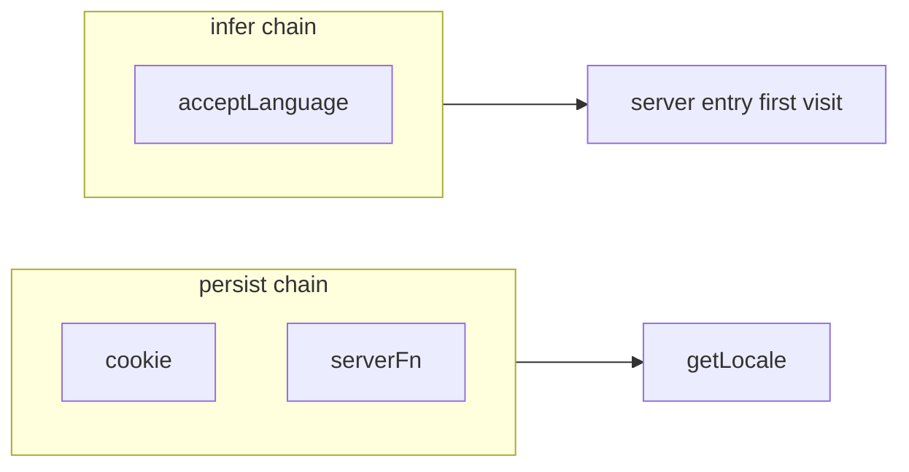

This guide explains **how locale is stored and inferred** on each request. You will configure cookie persistence, first-visit inference, optional session-backed locale for logged-in users, and adapter ordering — still on the same `en` / `ar` app.

## Prerequisites

- [Configuration](/guides/configuration) — `adapters` block in `locale-config.ts`
- [URL prefix modes](/guides/url-prefix) — especially `never` requiring persist

<Steps>
<Step>

### Persist vs infer

Two chains, two jobs:

| Chain | When it runs | Written on user switch |
| ----- | ------------ | ---------------------- |
| `persist[]` | Every `getLocale()`; server entry cookie sync | Yes |
| `infer[]` | First-visit server entry only | No |

**Persist** = user choice (cookie, database). **Infer** = machine guess (`Accept-Language`).

<Callout type="info">
Infer does **not** run in `getLocale()`. If it did, browser headers would override cookie after a manual language switch. Guarantees: [Behavior contract](/reference/behavior).
</Callout>



</Step>
<Step>

### Cookie adapter — anonymous visitors

Most marketing visitors are anonymous. When you omit `adapters`, persist defaults to **`[cookie()]`** — same as calling `cookie()` with no arguments:

```ts
import { cookie } from "@Wadiou/tanstack-i18n/adapters";

cookie()
```

Default cookie name is **`LOCALE`** (`DEFAULT_COOKIE_NAME`). Override only when needed:

```ts
cookie({ name: "MY_LOCALE" })
```

**Read:** server uses `Cookie` header; client uses `document.cookie`. Returns `null` if missing or not in `locales`.

**Write:** client uses Cookie Store API or `document.cookie`. Server does not call `write` directly — redirect/sync-cookie responses use `serialize(locale)` for `Set-Cookie`.

Tighten attributes for your domain:

```ts
cookie({
  path: "/",
  maxAge: 31536000,
  sameSite: "lax",
}),
```

Adapter id: `cookie:LOCALE`. Only **one** `cookie()` allowed in `persist[]`.

</Step>
<Step>

### localStorage adapter — client-only / SPA persistence

For Single Page Applications (SPAs) that do not use SSR, or where you want to store the selected language completely client-side in the browser:

```ts
import { localStorage } from "@Wadiou/tanstack-i18n/adapters";

localStorage()
```

Default key is **`LOCALE`** (`DEFAULT_LOCAL_STORAGE_KEY`). Override if needed:

```ts
localStorage({ key: "MY_LOCALE" })
```

- **Read:** Reads from `window.localStorage`. If a stored value exists and matches one of the supported locales, it returns it; otherwise, returns `null`.
- **Write:** Writes the active locale to `window.localStorage`.

Because `localStorage` is not sent with HTTP requests, it is ideal for pure client-side SPA setups (e.g. using TanStack React Router without TanStack Start). If you ever need to support SSR or server fallback in the future, you can also combine `localStorage` and `cookie` (the adapter is built to safely return `null` and no-op on the server without crashing):

```ts
adapters: {
  persist: [
    localStorage({ key: "LOCALE" }),
    cookie({ name: "LOCALE" }),
  ],
}
```

In this setup, `localStorage` is checked first on the client. If it returns `null` (e.g., during server-side rendering or on first load), the runtime falls back to the `cookie` adapter.

</Step>
<Step>

### Accept-Language — first visit to `/`

A visitor lands on `/` with no cookie. The server entry runs infer:

```ts
infer: [acceptLanguage()],
```

The adapter parses `Accept-Language`, picks the best match from `locales`, or returns `null`. Combined with `firstVisit.mode: "redirect"`, they may redirect to `/ar/` before any cookie exists.

This does **not** run on subsequent `getLocale()` calls — only the server entry first-visit path ([TanStack Start](/guides/tanstack-start)).

</Step>
<Step>

### serverFn — logged-in account locale

When the marketing site adds accounts, store locale in session/DB:

```ts
import { serverFn } from "@Wadiou/tanstack-i18n/adapters";

serverFn({
  read: async (ctx) => {
    if (!ctx.request) return null;
    return getLocaleFromSession(ctx.request);
  },
  write: async (locale, ctx) => {
    await saveLocaleToSession(locale, ctx.request);
  },
}),
```

`PersistRunContext` supplies `runtime`, `pathname`, `locales`, `defaultLocale`, `request`, `cookieHeader`.

Client `read` always returns `null` — client resolution uses cookie or URL. Server reads power SSR and the server entry.

</Step>
<Step>

### Order adapters — DB before cookie

**Read:** first adapter returning non-null wins.

**Write:** `changeLocale()` writes **all** persist adapters.

```ts
adapters: {
  persist: [
    serverFn({ read: fromDb, write: toDb }),
    cookie({ name: "LOCALE" }),
  ],
  infer: [acceptLanguage()],
},
```

Logged-in users resolve from DB; anonymous users fall through to cookie. Duplicate adapter ids fail at bind time.

</Step>
</Steps>

## How it works

On first unprefixed GET, the server entry may read infer, then persist, then redirect or set cookies. On every later request, `getLocale()` uses URL segment → persist chain → `defaultLocale` — infer is out of that path.

Path-scoped adapter overrides (empty infer on `/admin`, etc.): [Configuration — overrides](/guides/configuration#adapter-overrides).

## Complete example (so far)

Marketing site with anonymous cookie + first-visit infer:

```ts
adapters: {
  infer: [acceptLanguage()],
},
```

Persist defaults to `[cookie()]`. With accounts:

```ts
adapters: {
  persist: [
    serverFn({ read: fromSession, write: toSession }),
    cookie({ name: "LOCALE" }),
  ],
  infer: [acceptLanguage()],
},
```

## API reference

### Factory summary

| Factory | Kind | Role |
| ------- | ---- | ---- |
| `cookie(options)` | Persist | HTTP cookie |
| `localStorage(options)` | Persist | browser localStorage |
| `serverFn({ read, write })` | Persist | Your storage callbacks |
| `acceptLanguage()` | Infer | Header parse on unprefixed GET |

### `LocalStorageOptions`

| Option | Default |
| ------ | ------- |
| `key` | `"LOCALE"` |

### `CookieOptions`

| Option | Default |
| ------ | ------- |
| `name` | `"LOCALE"` |
| `path` | `"/"` |
| `maxAge` | `31536000` |
| `sameSite` | `"lax"` |

### `serverFn` callbacks

| Callback | Signature |
| -------- | --------- |
| `read` | `(ctx) => Locale \| null \| Promise<…>` |
| `write` | `(locale, ctx) => void \| Promise<void>` |

### Typical stacks

| Scenario | `persist` | `infer` |
| -------- | --------- | ------- |
| Marketing site (anonymous) | `[cookie(...)]` | `[acceptLanguage()]` optional |
| Logged-in + anonymous | `[serverFn, cookie]` | optional |
| `prefix: "never"` | required | optional |
| Skip infer on API | base + override empty `infer` on `/api` | — |

## What's next

Wrap the Start server handler so infer and persist participate in redirects: [TanStack Start](/guides/tanstack-start).
