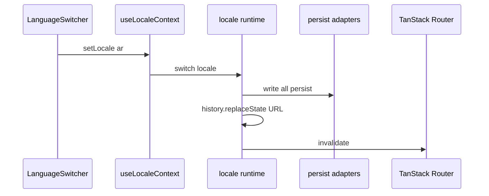

To allow users to switch languages, the header needs a **language switcher** that updates the URL, cookie, and router in one gesture. This guide explains how to wire `createLocaleProvider` and build a switcher with `useLocaleContext`.

## Prerequisites

- [Locale runtime](/guides/locale-runtime)
- [TanStack Router](/guides/tanstack-router) — app wrapped in `RouterProvider`
- A hook that returns the active locale string from your message library (or route context)

<Steps>
<Step>

### Define the provider

TanStack i18n does not ship message catalogs. The provider reads locale from **your** hook and handles switching (persist, URL, router invalidate):

```ts
// src/i18n/provider.tsx
import { createLocaleProvider } from "@wadiou/tanstack-i18n/react";
import { locale } from "../locale";
import { useLocale } from "./use-locale"; // wraps use-intl, route, etc.

export const { LocaleProvider, useLocaleContext } = createLocaleProvider({
  runtime: locale,
  useLocale,
});
```

Mount `LocaleProvider` inside your root route layout (nested under your message provider and router). For the complete provider layout and nesting structure, see the [use-intl integration guide](/integrations/use-intl).

</Step>
<Step>

### Build the switcher

```tsx
function LanguageSwitcher() {
  const { locales, locale, setLocale } = useLocaleContext();

  return (
    <select
      aria-label="Language"
      value={locale}
      onChange={(e) => void setLocale(e.target.value)}
    >
      {locales.map((code) => (
        <option key={code} value={code}>
          {code === "en" ? "English" : "العربية"}
        </option>
      ))}
    </select>
  );
}
```

`useLocaleContext` fields:

| Field | Source |
| ----- | ------ |
| `locale` | Your `useLocale` hook |
| `locales` | `config.locales` |
| `defaultLocale` | `config.defaultLocale` |
| `setLocale` | Provider — persist, URL, router invalidate |

</Step>
<Step>

### What happens on `setLocale("ar")`

1. No-op if already `ar`
2. **All** persist adapters write (`LOCALE` cookie, session if configured)
3. URL updates via `history.replaceState` — `/en/about` → `/ar/about` (unless path ignored)
4. `router.invalidate()` reloads loaders and your message hook picks up `ar`

Browser only — call `setLocale` from event handlers, not loaders.

Flow details: persist writes in [Adapters](/guides/adapters); resolution order in [Behavior contract](/reference/behavior).

</Step>
<Step>

### Solid marketing site

Same API from `@wadiou/tanstack-i18n/solid`:

```ts
import { createLocaleProvider } from "@wadiou/tanstack-i18n/solid";

export const { LocaleProvider, useLocaleContext } = createLocaleProvider({
  runtime: locale,
  useLocale,
});
```

Types: `CreateLocaleProviderDeps`, `LocaleContextValue`.

</Step>
</Steps>

## How it works



TanStack i18n owns routing + persist. Your library owns strings — reload catalogs when locale changes via root `beforeLoad`. Full recipe: **[use-intl](/integrations/use-intl)**. Overview: [Get started — locale vs messages](/get-started#locale-vs-messages).

## Complete example (so far)

Header in marketing layout:

```tsx
import { LanguageSwitcher } from "./LanguageSwitcher";
import { LocalizedLink } from "../i18n/routes";

function Header() {
  return (
    <header>
      <LocalizedLink to="/">Home</LocalizedLink>
      <LocalizedLink to="/about">About</LocalizedLink>
      <LanguageSwitcher />
    </header>
  );
}
```

## API reference

### `createLocaleProvider({ runtime, useLocale })`

Returns `{ LocaleProvider, useLocaleContext }`. Mount `LocaleProvider` inside `RouterProvider`. Use **`setLocale`** from `useLocaleContext` in UI — not the core runtime directly.

## What's next

Wire message catalogs: **[use-intl](/integrations/use-intl)**. Runtime guarantees: [Behavior contract](/reference/behavior).
