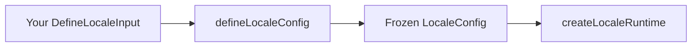

This guide builds configuration for a fictional **bilingual marketing site** (`en`, `ar`) using TanStack Start and Router. Every later guide continues the same app.

## Prerequisites

- [Get started](/get-started) — install and skim the end-to-end snippet
- You know which locale codes your app supports (we use `en` and `ar`)

<Steps>
<Step>

### Declare supported locales

Start with the smallest valid config — `locales` and `defaultLocale`. Everything else gets sensible defaults.

Create `src/locale-config.ts`:

```ts
import { defineLocaleConfig } from "@Wadiou/tanstack-i18n";

export const config = defineLocaleConfig({
  locales: ["en", "ar"],
  defaultLocale: "en",
});
```

`defaultLocale` must appear in `locales`. It is the fallback when the URL and persist adapters yield nothing, and drives unprefixed URLs under `as-needed`.

</Step>
<Step>

### URL prefix mode (default `as-needed`)

You do not need a `url` block on day one. The default prefix is **`as-needed`**: English (default) uses unprefixed paths; other locales get a segment.

| Active locale | `/about` pathname |
| ------------- | ----------------- |
| `en` (default) | `/about` |
| `ar` | `/ar/about` |

That is already what the one-field config above produces. To change behavior, add `url`:

```ts
url: { prefix: "always" }, // every locale prefixed — see URL prefix guide
```

Prefix modes (`always`, `never`, custom maps) change URL shape dramatically. Details: [URL prefix modes](/guides/url-prefix).

</Step>
<Step>

### Persist user preference (default cookie)

When you omit `adapters`, persist defaults to **`[cookie()]`** — a `LOCALE` cookie on `/` with `SameSite=lax`.

Visitors who pick a language keep it on the next visit. Persist adapters run on every `getLocale()` and are written when the user switches locale.

Override the cookie only when you need a custom name or attributes:

```ts
import { cookie } from "@Wadiou/tanstack-i18n";

adapters: {
  persist: [cookie({ name: "MY_LOCALE", sameSite: "strict" })],
},
```

Cookie options and server vs client behavior: [Adapters](/guides/adapters).

</Step>
<Step>

### Infer locale on first visit

Before a cookie exists, the server can guess from `Accept-Language`. That belongs in **infer**, not persist — and you opt in explicitly:

```ts
import { acceptLanguage } from "@Wadiou/tanstack-i18n/adapters";

adapters: {
  infer: [acceptLanguage()],
},
```

With only `locales` set, infer stays `[]`. Infer runs only in the **server entry** first-visit flow — not inside `getLocale()` after the user has chosen a locale. Why that matters: [Adapters — persist vs infer](/guides/adapters#persist-vs-infer) and [Behavior contract](/reference/behavior).

</Step>
<Step>

### Choose first-visit behavior

When someone hits `/` without a locale prefix, the server entry must decide what to do. Default is **redirect** — localize the URL and send them to `/about` or `/ar/about`.

```ts
firstVisit: { mode: "redirect" },
```

Alternatively, **detect** renders the page without redirecting and sets a response header so you can show a “Switch to Arabic?” banner:

```ts
firstVisit: {
  mode: "detect",
  detectedLocaleHeader: "X-Locale-Detected",
},
```

Detect wiring on Start: [TanStack Start](/guides/tanstack-start). Default header constant: `DEFAULT_DETECTED_LOCALE_HEADER` from `@Wadiou/tanstack-i18n`.

</Step>
<Step>

### Path-scoped overrides (advanced)

Sometimes one pathname needs different adapter or first-visit rules. Add `adapters.overrides` — **first matching rule wins**.

Skip infer on admin routes:

```ts
adapters: {
  infer: [acceptLanguage()],
  overrides: [
    {
      target: "infer",
      match: ({ pathname }) => pathname.startsWith("/admin"),
      infer: [],
    },
  ],
},
```

Detect mode on the landing page only:

```ts
{
  target: "firstVisit",
  match: ({ pathname }) => pathname === "/",
  firstVisit: { mode: "detect" },
},
```

</Step>
</Steps>

## How it works

`defineLocaleConfig` validates input and returns a **frozen** `LocaleConfig`. It does not touch the network.



Normalization fills defaults you omit — see API reference below. Bind-time validation (empty persist with `never` prefix, duplicate adapter ids, etc.) runs in `createLocaleRuntime`: [Locale runtime](/guides/locale-runtime).

## Complete example (so far)

`src/locale-config.ts` for the marketing site:

```ts
import { defineLocaleConfig } from "@Wadiou/tanstack-i18n";
import { acceptLanguage } from "@Wadiou/tanstack-i18n/adapters";

export const config = defineLocaleConfig({
  locales: ["en", "ar"],
  defaultLocale: "en",
  url: {
    ignoredPaths: /^\/api(?:\/|$)/,
  },
  adapters: {
    infer: [acceptLanguage()],
  },
  firstVisit: {
    mode: "redirect",
  },
});
```

Omitted fields normalize to: `url.prefix: "as-needed"`, `` `url.segment`: `{-$locale}` ``, `persist: [cookie()]`, and the `infer` chain shown above. Export this from a single module. The next guide compares prefix modes; [Adapters](/guides/adapters) deepens cookie and infer; [Locale runtime](/guides/locale-runtime) binds `createLocaleRuntime(config)`.

## API reference

### Field summary

| Field | Required | Role |
| ----- | -------- | ---- |
| `locales` | yes | Allowed locale codes |
| `defaultLocale` | yes | Fallback — must be in `locales` |
| `url` | no | Prefix, ignored paths, router segment |
| `adapters` | no | Persist, infer, overrides |
| `adapters.persist` | no | Default `[cookie()]` |
| `adapters.infer` | no | Default `[]` — add `acceptLanguage()` explicitly |
| `adapters.overrides` | no | Path-scoped rules |
| `firstVisit` | no | Unprefixed GET behavior |

### Defaults at a glance

After `defineLocaleConfig`, these fields are always present on the frozen config:

| Field | Default when omitted |
| ----- | -------------------- |
| `url.prefix` | `"as-needed"` (`DEFAULT_URL_PREFIX`) |
| `url.segment` | `` `{-$locale}` `` |
| `adapters.persist` | `[cookie()]` — name `LOCALE` (`DEFAULT_COOKIE_NAME`) |
| `adapters.infer` | `[]` |
| `firstVisit.mode` | `"redirect"` |
| `firstVisit.detectedLocaleHeader` | `"X-Locale-Detected"` (`DEFAULT_DETECTED_LOCALE_HEADER`) |

`config.persist` / `config.infer` mirror `config.adapters.*` after define.

### Override rule targets

| `target` | Effect when `match` is true |
| -------- | ----------------------------- |
| `"persist"` | Replace entire `persist[]` |
| `"infer"` | Replace entire `infer[]` |
| `"firstVisit"` | Merge partial `firstVisit` over global |

### Validation (`LocaleConfigError`)

**At `defineLocaleConfig`:** non-empty `locales`; non-blank locale strings; `defaultLocale` in `locales`.

**At `createLocaleRuntime`:** at least one persist or infer adapter; persist required when `url.prefix` is `"never"`; unique adapter ids; at most one `cookie()`; infer adapters must not define `write`.

## What's next

Continue the same marketing app in [URL prefix modes](/guides/url-prefix) — walk `as-needed` (default), `always`, and `never` with real `/about` URLs.
