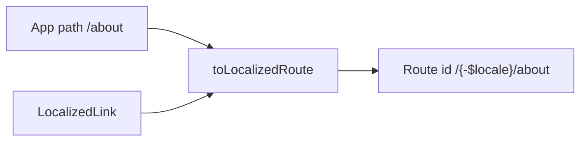

To organize routing in your app, TanStack Router needs a **route tree** and navigation helpers so components can use `"/about"` instead of hard-coding `"/en/about"`. This guide explains how to add a `` `{-$locale}` `` route folder, map de-localized paths with `createToLocalizedRoute`, and replace `Link`, `navigate`, and loader redirects with localized helpers.

## Prerequisites

- [URL prefix modes](/guides/url-prefix) — `url.segment` default `` `{-$locale}` ``
- [Locale runtime](/guides/locale-runtime) — `locale` export
- `@Wadiou/tanstack-i18n/react-router` or `@Wadiou/tanstack-i18n/solid-router` installed — [Exports and peers](/reference/exports)
- For Full-stack / SSR apps: [TanStack Start](/guides/tanstack-start) — server entry and localized HTTP paths

<Steps>
<Step>

### Create the localized route folder

Mirror HTTP prefix `always` with a dynamic segment in the file tree:

```
src/routes/
  __root.tsx
  {-$locale}/
    index.tsx       # /en/, /ar/
    about.tsx       # /en/about, /ar/about
    pricing.tsx
```

Route ids in the generated tree include the locale prefix — e.g. `` `/{-$locale}/about` ``. Set `url.segment` in config if you rename the segment ([URL prefix modes](/guides/url-prefix)).

</Step>
<Step>

### Map de-localized paths — `createToLocalizedRoute`

App code should not hard-code `"/en/about"`. Create a mapper from config:

```ts
// src/i18n/routes.ts
import { createToLocalizedRoute } from "@Wadiou/tanstack-i18n/react-router"; // or /solid-router
import { config } from "../locale-config";

export const toLocalizedRoute = createToLocalizedRoute(config);
```

Usage in the marketing site:

```ts
toLocalizedRoute("/");       // → "/{-$locale}"
toLocalizedRoute("/about");   // → "/{-$locale}/about"
toLocalizedRoute("/pricing");
```

Type helpers (`DeLocalizedTo`, etc.) keep `to` props aligned with your route tree while you author paths without the locale prefix.

</Step>
<Step>

### Localized links

Create navigation helpers once:

```ts
import { createNavigation } from "@Wadiou/tanstack-i18n/react-router"; // or /solid-router

export const { LocalizedLink, useLocalizedNavigate, localizedRedirect } =
  createNavigation({ toLocalizedRoute });
```

Replace header nav links:

```tsx
// Before
<Link to="/$locale/about" params={{ locale: "en" }}>About</Link>

// After — active locale comes from routing + getLocale()
<LocalizedLink to="/about">About</LocalizedLink>
```

`LocalizedLink` accepts the same props as TanStack Router `Link` except `to` is de-localized.

</Step>
<Step>

### Programmatic navigation

CTA button on the marketing home page:

```tsx
function StartTrialButton() {
  const navigate = useLocalizedNavigate();
  return (
    <button type="button" onClick={() => navigate({ to: "/pricing" })}>
      Start trial
    </button>
  );
}
```

The helper maps `/pricing` → `` `/{-$locale}/pricing` `` using the current route context.

</Step>
<Step>

### Loader redirects

Protect a dashboard route — redirect anonymous users to login with a de-localized target:

```ts
// routes/{-$locale}/dashboard.tsx
export const Route = createFileRoute("/{-$locale}/dashboard")({
  beforeLoad: ({ context }) => {
    if (!context.user) {
      throw localizedRedirect({ to: "/login" });
    }
  },
});
```

`localizedRedirect` throws TanStack Router `redirect()` with the mapped route id.

If you use `prefix: "as-needed"`, de-localized `"/about"` still maps correctly — the helper uses route ids, not raw HTTP paths. When links 404 after a prefix change, re-check [URL prefix modes](/guides/url-prefix) and that `toLocalizedRoute` uses the same `config` as `defineLocaleConfig`.

</Step>
<Step>

### Keep config and helpers in one module

Export everything from `src/i18n/routes.ts` so layout, CTAs, and loaders share one `toLocalizedRoute`:

```ts
export { toLocalizedRoute, LocalizedLink, useLocalizedNavigate, localizedRedirect };
```

Importing `createToLocalizedRoute` in multiple files with different config slices causes subtle route id mismatches on the marketing site.

</Step>
<Step>

### Solid apps

A dedicated `@Wadiou/tanstack-i18n/solid-router` subpath is fully supported! It exports the exact same `createNavigation` API, but wraps **Solid** Router's `Link`, `useNavigate`, and `redirect` with idiomatic Solid JS patterns. Use it exactly as shown above.

</Step>
</Steps>

## How it works



HTTP locale segments come from `url.prefix`. Router ids come from `url.segment`. Both must agree with your file tree.

User-initiated locale changes update URL + router: [Change locale](/guides/change-locale).

## Complete example (so far)

```ts
// src/i18n/routes.ts
import { createNavigation, createToLocalizedRoute } from "@Wadiou/tanstack-i18n/react-router"; // or /solid-router
import { config } from "../locale-config";

export const toLocalizedRoute = createToLocalizedRoute(config);
export const { LocalizedLink, useLocalizedNavigate, localizedRedirect } =
  createNavigation({ toLocalizedRoute });
```

Use these exports in marketing site layout, CTAs, and protected loaders.

## API reference

### `createToLocalizedRoute(config)`

Returns `(to) => routeId` using `config.url.segment` (default `` `{-$locale}` ``).

### `createNavigation({ toLocalizedRoute })`

| Export | Role |
| ------ | ---- |
| `LocalizedLink` | `Link` with de-localized `to` |
| `useLocalizedNavigate` | Hook; `navigate({ to: "/path" })` |
| `localizedRedirect` | Loader redirect with de-localized `to` |

### Type helpers

`DeLocalizedTo`, `LocalePrefixedRoutes`, `LocalizedLinkProps`, etc. — exported from `@Wadiou/tanstack-i18n/react-router` and `@Wadiou/tanstack-i18n/solid-router` for typed route trees.

## What's next

Add a language switcher that updates persist, URL, and router together: [Change locale](/guides/change-locale).
