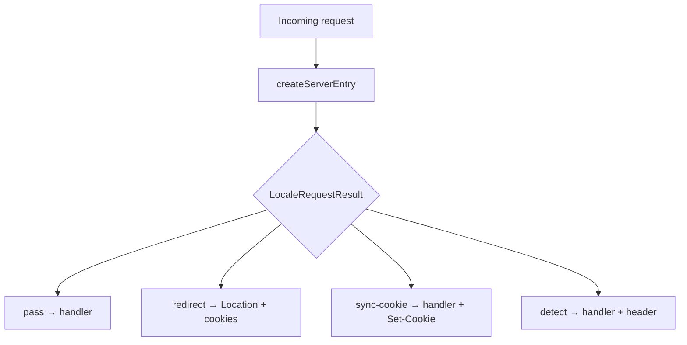

To use `@Wadiou/tanstack-i18n` with TanStack Start, you need to wrap the **Start fetch handler**. This guide explains how to install the Start subpath, wrap your handler with `createServerEntry`, and walk through what happens when a visitor hits `/` with no cookie — redirect, cookie sync, or detect banner.

## Prerequisites

- [Locale runtime](/guides/locale-runtime) — `locale` export
- [Adapters](/guides/adapters) — persist + infer chains
- [Configuration](/guides/configuration) — `firstVisit.mode`

<Steps>
<Step>

### Wrap the fetch handler

```ts
// src/server.ts (or your Start entry)
import handler from "@tanstack/react-start/server-entry";
import { locale } from "./locale";

export default {
  fetch: locale.createServerEntry((request: Request) => handler.fetch(request)),
};
```

Install `@Wadiou/tanstack-i18n/react-start` or `@Wadiou/tanstack-i18n/solid-start` if you re-export from that subpath — [Exports and peers](/reference/exports).

The wrapper runs **before** your handler. Your routes see an already-localized request when the action is `pass`, `sync-cookie`, or `detect`.

</Step>
<Step>

### First visit: unprefixed GET → redirect

Scenario: marketing site uses `prefix: "always"`. Visitor requests `GET /` with `Accept-Language: ar` and no `LOCALE` cookie.

1. Server entry runs infer → `ar`
2. Active locale for redirect target derived from persist (none) + config
3. Action **`redirect`** — `Location: /ar/` (or `/ar` per canonical rules), **307** when status omitted
4. `Set-Cookie` may attach persist locale

After redirect, normal route handling runs on `/ar/`. Full guarantees: [Behavior contract](/reference/behavior).

</Step>
<Step>

### URL correct but cookie missing: sync-cookie

Visitor opens `/en/about` directly (bookmark). URL matches locale; cookie not set yet.

Action **`sync-cookie`**: your handler runs; response includes `Set-Cookie` for `LOCALE=en`. No redirect.

Common after clearing cookies while URL still shows a prefix.

</Step>
<Step>

### Detect mode on landing

Marketing wants a banner instead of forcing redirect on `/`:

```ts
// locale-config.ts
firstVisit: { mode: "detect" },
```

Unprefixed GET with infer → `en`, persist → default `zh`:

Action **`detect`**: handler runs; page renders in **activeLocale** (`zh` via persist/default); response header `X-Locale-Detected: en` (or your `detectedLocaleHeader`).

<Callout type="info">
  **Runnable Example:**
  For a complete, working demonstration showing how the server loader extracts the detected language, passes it to the router context, and displays a language banner, refer to the [react-start-detect example](/examples#react-start-detect).
</Callout>

Path-scoped detect on `/` only: [Configuration — overrides](/guides/configuration#adapter-overrides).

</Step>
</Steps>

## How it works



Adapter roles in each branch: [Adapters](/guides/adapters). Isomorphic reads for loaders: [Locale runtime](/guides/locale-runtime).

## Complete example (so far)

```ts
import handler from "@tanstack/react-start/server-entry";
import { locale } from "./locale";

export default {
  fetch: locale.createServerEntry((request: Request) => handler.fetch(request)),
};
```

Wrap client app with `createLocaleProvider` after server wiring: [Change locale](/guides/change-locale).

## First-visit Customization

When a user visits your app for the first time without a locale prefix in the URL and without any preference saved in cookies/local storage, the middleware uses the `infer` adapter (like `acceptLanguage()`) to determine their preferred locale. 

You can configure what happens during this first visit using the `firstVisit` option in `defineLocaleConfig`.

### 1. Redirect Mode (Default)
In redirect mode, the server entry immediately redirects first-time visitors to the URL corresponding to their inferred locale.

```ts
// src/locale-config.ts
export const config = defineLocaleConfig({
  locales: ["en", "ar"],
  defaultLocale: "en",
  firstVisit: {
    mode: "redirect", // Default behavior
  },
  adapters: {
    infer: [acceptLanguage()],
  },
});
```

* **Behavior**: If a user's browser sends `Accept-Language: ar` and they visit `/`, they are automatically redirected (HTTP 307) to `/ar/`.
* **Pros**: Simple, zero friction, immediately presents the site in the user's preferred language.
* **Cons**: Search engine crawlers or users with misconfigured browser languages might be redirected unexpectedly.

### 2. Detect Mode (Banner-based UX)
In detect mode, the server entry does *not* redirect the user. It serves the page in the default locale, but attaches a response header specifying the detected preferred language.

```ts
// src/locale-config.ts
export const config = defineLocaleConfig({
  locales: ["en", "ar"],
  defaultLocale: "en",
  firstVisit: {
    mode: "detect",
    detectedLocaleHeader: "X-Locale-Detected", // Defaults to "X-Locale-Detected"
  },
  adapters: {
    infer: [acceptLanguage()],
  },
});
```

The server entry sets a response header with the detected locale. To use it in your UI, call the isomorphic `getDetectedLocale()` helper inside `beforeLoad` (where request headers are available) and pass the result down via router context. Then render a banner component that receives `detectedLocale` as a prop and calls `setLocale` when the user confirms.

```tsx
// In your root route's beforeLoad:
const detectedLocale = getDetectedLocale(); // returns TLocale | null
return { locale: active, messages, detectedLocale };
```

* **Behavior**: The page loads under `/` (English). The user sees a premium language-selection banner offering to switch to `/ar/`.
* **Pros**: Non-intrusive, crawler-friendly, puts the user in control.
* **Cons**: Requires additional UI implementation (banner) to notify the user.

### 3. Custom Header Name
If you need to change the header name (for instance, to avoid conflicts with reverse proxies or load balancers), you can set `detectedLocaleHeader`:

```ts
firstVisit: {
  mode: "detect",
  detectedLocaleHeader: "My-Custom-Detect-Header",
}
```

### 4. Path-scoped First-visit Overrides
You can customize first-visit behaviors for specific subpaths using `overrides`. For example, you may want "redirect" behavior for the rest of your site, but "detect" behavior solely on the landing page `/` to ensure a smooth, non-disruptive homepage experience:

```ts
// src/locale-config.ts
export const config = defineLocaleConfig({
  locales: ["en", "ar"],
  defaultLocale: "en",
  firstVisit: {
    mode: "redirect", // Global default
  },
  adapters: {
    infer: [acceptLanguage()],
    overrides: [
      {
        target: "firstVisit",
        match: ({ pathname }) => pathname === "/",
        firstVisit: {
          mode: "detect", // Detect only on the homepage
        },
      },
    ],
  },
});
```

## API reference

### Outcome summary

| Action | When (simplified) | Effect |
| ------ | ----------------- | ------ |
| `pass` | URL and persist aligned | Handler unchanged |
| `redirect` | Path needs locale segment | `Location` + cookies; 307 default |
| `sync-cookie` | URL OK, persist missing | Handler + `Set-Cookie` |
| `detect` | Detect mode; infer ≠ active | Handler + detect header |

Contract details: [Behavior contract](/reference/behavior).

## What's next

Wire the Router tree and de-localized navigation: [TanStack Router](/guides/tanstack-router).
