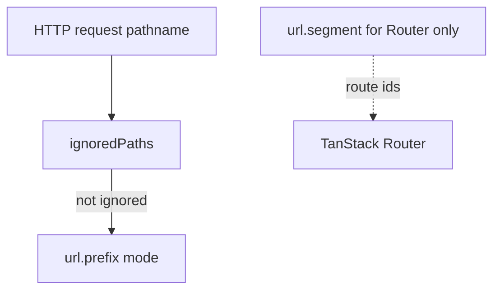

By default, `url.prefix` is **`as-needed`** — English uses `/about`, Arabic uses `/ar/about`. That choice controls **HTTP pathnames** — what users see in the address bar. This guide changes prefix mode on the **same** `en` / `ar` app so you can compare outcomes without relearning the config shape.

## Prerequisites

- [Configuration](/guides/configuration) — `locale-config.ts` with locales and adapters
- Mental model: `getLocale()` reads URL segment first when the prefix mode exposes one — [Behavior contract](/reference/behavior)

<Steps>
<Step>

### Baseline: `as-needed` (default)

If you only set `locales` in [Configuration](/guides/configuration), you already have `prefix: "as-needed"`. For path `/about`:

| Active locale | Pathname |
| ------------- | -------- |
| `en` (default) | `/about` |
| `ar` | `/ar/about` |

No `url` block required. English stays short; other locales stay prefixed.

<Callout type="info">
The server entry canonicalizes URLs. If English pages still redirect to `/en/about`, confirm `url.prefix` is `as-needed` and the server entry wraps your app handler — see [Behavior contract](/reference/behavior).
</Callout>

</Step>
<Step>

### Every locale prefixed: `always`

Some teams want `/en/about` even for the default locale — clearer in analytics and hreflang:

```ts
url: { prefix: "always" },
```

| Active locale | Pathname |
| ------------- | -------- |
| `en` | `/en/about` |
| `ar` | `/ar/about` |

SEO-friendly: each locale has a distinct URL. Downside: default locale URLs are longer than `as-needed`.

</Step>
<Step>

### Hidden locale in the URL: `never`

Some apps keep `/about` for every locale and store the active locale in a cookie or session only:

```ts
url: { prefix: "never" },
// persist defaults to [cookie()] — required for never mode
```

| Active locale | Pathname |
| ------------- | -------- |
| `en` | `/about` |
| `ar` | `/about` |

`createLocaleRuntime` **requires at least one persist adapter** when prefix is `"never"`. Validation: [Configuration — API reference](/guides/configuration#api-reference).

</Step>
<Step>

### Branded path segments: per-locale map

Marketing sometimes wants `/english/about` instead of `/en/about`:

```ts
url: {
  prefix: {
    en: "english",
    ar: "arabic",
  },
},
```

| Active locale | Pathname |
| ------------- | -------- |
| `en` | `/english/about` |
| `ar` | `/arabic/about` |

Keys must match entries in `locales`.

</Step>
<Step>

### Exclude APIs from locale middleware

Your marketing site exposes `/api/newsletter`. Locale redirects should not touch it:

```ts
url: {
  prefix: "always",
  ignoredPaths: /^\/api(?:\/|$)/,
},
```

Or a predicate:

```ts
ignoredPaths: (pathname) => pathname.startsWith("/api"),
```

On ignored paths:

- Server entry does not redirect for locale
- `changeLocale()` still writes persist adapters but **skips** URL rewrite

Typical ignores: `/api`, `/health`, webhooks, static admin tools.

</Step>
<Step>

### Router segment vs HTTP prefix

TanStack Router route ids use `url.segment` — default `` `{-$locale}` ``. This does **not** parse HTTP requests.

```ts
url: {
  prefix: "always",       // HTTP: /en/about
  segment: "{-$locale}", // Router id: /{-$locale}/about
},
```

File layout for the marketing site:

```
src/routes/
  {-$locale}/
    index.tsx      # home
    about.tsx
```

If you change `segment`, update both config and the route tree. Wiring links and navigators: [TanStack Router](/guides/tanstack-router).

</Step>
</Steps>

## How it works

HTTP pathname parsing and URL rewrite use `url.prefix` and `ignoredPaths` only. Router helpers use `url.segment` to map de-localized paths like `"/about"` to route ids.



Runtime helpers `localizeUrl` and `deLocalizeUrl` follow the same prefix rules: [Locale runtime](/guides/locale-runtime).

## Complete example (so far)

Marketing site with default `as-needed`, API ignore, and router segment:

```ts
url: {
  ignoredPaths: /^\/api(?:\/|$)/,
  segment: "{-$locale}",
},
```

## API reference

### `LocalePrefix` shapes

| Value | Meaning |
| ----- | ------- |
| `"always"` | Every locale gets a path prefix |
| `"as-needed"` | Default locale omits prefix |
| `"never"` | No prefix; persist required |
| `Record<Locale, string>` | Custom segment per locale |

### `LocaleUrlConfig` sub-fields

| Sub-field | Default | Role |
| --------- | ------- | ---- |
| `prefix` | `"as-needed"` | See table above |
| `ignoredPaths` | none | RegExp or `(pathname) => boolean` |
| `segment` | `` `{-$locale}` `` | Router route id token only |

### Choosing a mode (decision guide)

| Your goal | Mode |
| --------- | ---- |
| Same URL shape for every locale | `always` |
| Shorter URLs for default locale | `as-needed` |
| Locale only in cookie/session | `never` + persist |
| Legacy or marketing path names | per-locale map |

## What's next

Bind config to handlers in [Locale runtime](/guides/locale-runtime), then deepen adapter behavior in [Adapters](/guides/adapters).
