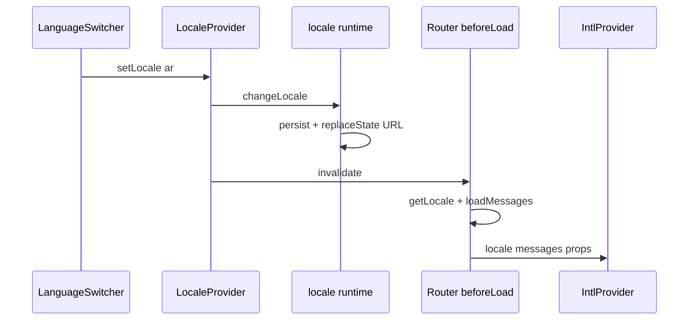
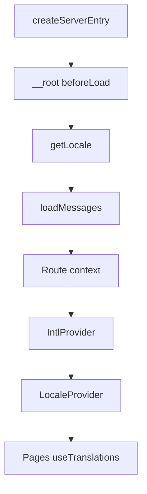

**Supported Frameworks:** `React`

<Callout type="info">
  **Runnable References:**
  - **React Start (SSR)**: [`examples/react/start/use-intl/`](https://github.com/Wadiou/tanstack-i18n/tree/main/examples/react/start/use-intl)
  - **React Router (SPA)**: [`examples/react/router/use-intl/`](https://github.com/Wadiou/tanstack-i18n/tree/main/examples/react/router/use-intl)
</Callout>

**use-intl** adds message catalogs and `useTranslations` while TanStack i18n keeps owning locale in the URL. This guide explains how to add JSON message files, load them in root `beforeLoad`, wrap the app with `IntlProvider` **outside** `LocaleProvider`, and translate the marketing header. Language switches reload messages through router invalidation — same `setLocale` flow as before.

## Prerequisites

- Guides through [Change locale](/guides/change-locale)
- [Locale runtime](/guides/locale-runtime) exports `locale`
- [TanStack Start](/guides/tanstack-start) server entry wraps `handler.fetch`

### Responsibility split

| Layer | Owns | Package |
| ----- | ---- | ------- |
| URL locale, redirects, cookie, `setLocale` | Routing + persist | `@Wadiou/tanstack-i18n` |
| Message catalogs, `t()`, dates/numbers | Translation | `use-intl` |

**Critical rule:** Switch language with **`setLocale` from `useLocaleContext`** — not a separate locale setter inside use-intl. After `setLocale`: persist + URL update + `router.invalidate()` → root `beforeLoad` re-runs → `loadMessages` → `IntlProvider` gets new `locale` and `messages`.

<Steps>
<Step>

### Install use-intl

```bash
pnpm add use-intl
```

Peer: `react`. Keep `@Wadiou/tanstack-i18n` and subpaths from the guides. use-intl is the [core library](https://next-intl.dev/docs/environments/core-library) — APIs are `IntlProvider` and `use-intl`, not `NextIntlClientProvider`.

</Step>
<Step>

### Add message files

Organize copy per locale and namespace. For the marketing site, start with `Landing` and `Common`:

```json
// i18n/messages/en/landing.json
{
  "hero": "Welcome to our site",
  "aboutLink": "About us"
}
```

```json
// i18n/messages/ar/landing.json
{
  "hero": "مرحبًا بكم في موقعنا",
  "aboutLink": "من نحن"
}
```

Merge namespaces into one object use-intl expects:

```ts
// src/i18n/merge-messages.ts
import type enLanding from "@/i18n/messages/en/landing.json";
import type enCommon from "@/i18n/messages/en/common.json";

export type Messages = {
  Landing: typeof enLanding;
  Common: typeof enCommon;
};

export function mergeMessages(m: {
  landing: typeof enLanding;
  common: typeof enCommon;
}): Messages {
  return { Landing: m.landing, Common: m.common };
}
```

Per-locale barrels import JSON and call `mergeMessages`:

```ts
// src/i18n/locales/en.ts
import landing from "@/i18n/messages/en/landing.json";
import common from "@/i18n/messages/en/common.json";
import { mergeMessages } from "../merge-messages";

export default mergeMessages({ landing, common });
```

Message loading stays **app code** — TanStack i18n does not ship catalogs.

</Step>
<Step>

### Implement loadMessages

Dynamic import per locale keeps bundles split:

```ts
// src/i18n/load-messages.ts
import type { Messages } from "./merge-messages";

const loaders = {
  en: () => import("./locales/en"),
  ar: () => import("./locales/ar"),
} as const satisfies Record<string, () => Promise<{ default: Messages }>>;

export async function loadMessages(locale: keyof typeof loaders): Promise<Messages> {
  const { default: messages } = await loaders[locale]();
  return messages;
}
```

</Step>
<Step>

### Root beforeLoad — locale + messages

Resolve locale with the runtime, then load messages. On `__root.tsx`:

```ts
import { createRootRouteWithContext } from "@tanstack/react-router";
import { getLocale } from "@/locale";
import { loadMessages } from "@/i18n/load-messages";
import type { Messages } from "@/i18n/merge-messages";

type Locale = "en" | "ar";

interface RouterContext {
  locale: Locale;
  messages: Messages;
}

export const Route = createRootRouteWithContext<RouterContext>()({
  beforeLoad: async () => {
    const active = await getLocale();
    const messages = await loadMessages(active);
    return { locale: active, messages };
  },
  component: RootComponent,
});
```

`getLocale()` (imported from `src/locale.ts`) uses URL segment → persist adapters → `defaultLocale` ([Behavior contract](/reference/behavior)). Prefer root `beforeLoad` over a nested-only loader so every route shares one message load.

</Step>
<Step>

### IntlProvider (outer) — pass loader data

`RootComponent` reads route context and wraps the tree. **`IntlProvider` is outer**; `LocaleProvider` is inner:

```tsx
import { IntlProvider } from "use-intl";
import { Outlet } from "@tanstack/react-router";
import { LocaleProvider } from "@/i18n/provider";

function RootComponent() {
  const { locale, messages } = Route.useRouteContext();

  return (
    <html lang={locale} dir={locale === "ar" ? "rtl" : "ltr"}>
      <body>
        <IntlProvider locale={locale} messages={messages} timeZone="UTC">
          <LocaleProvider>
            <Outlet />
          </LocaleProvider>
        </IntlProvider>
      </body>
    </html>
  );
}
```

Why outer? `LocaleProvider` calls `useLocale` from use-intl inside its render — that hook requires an `IntlProvider` ancestor. The `locale` prop on `IntlProvider` is the source of truth; use-intl's `useLocale()` is read-only.

</Step>
<Step>

### createLocaleProvider (inner) — bridge hook

Pass `useLocale` from use-intl directly:

```ts
// src/i18n/provider.tsx
import { createLocaleProvider } from "@Wadiou/tanstack-i18n/react";
import { useLocale } from "use-intl";
import { locale } from "@/locale";

export const { LocaleProvider, useLocaleContext } = createLocaleProvider({
  runtime: locale,
  useLocale,
});
```

This replaces hand-rolled switch logic (cookie + URL rewrite + invalidate) with **`setLocale`** from [Change locale](/guides/change-locale). Mount `LocaleProvider` inside `IntlProvider`, both under the router (TanStack Start `RootComponent` is already inside the router).

</Step>
<Step>

### Translate a page

```tsx
import { useTranslations } from "use-intl";
import { LocalizedLink } from "@/i18n/routes";

function MarketingHeader() {
  const t = useTranslations("Landing");

  return (
    <header>
      <h1>{t("hero")}</h1>
      <LocalizedLink to="/about">{t("aboutLink")}</LocalizedLink>
    </header>
  );
}
```

Navigation stays on [TanStack Router helpers](/guides/tanstack-router) — use-intl only replaces string content.

</Step>
<Step>

### Language switcher — unchanged API

Keep the switcher from [Change locale](/guides/change-locale):

```tsx
function LanguageSwitcher() {
  const { locales, locale, setLocale } = useLocaleContext();

  return (
    <select
      aria-label="Language"
      value={locale}
      onChange={(e) => void setLocale(e.target.value)}
    >
      {locales.map((code) => (
        <option key={code} value={code}>
          {code === "en" ? "English" : "العربية"}
        </option>
      ))}
    </select>
  );
}
```

Do **not** add a second locale setter from use-intl — TanStack i18n owns the switch gesture.

</Step>
<Step>

### Switch flow end-to-end

When the user picks `ar`:

1. `setLocale("ar")` — no-op if already `ar`
2. Persist adapters write (cookie)
3. URL updates via `history.replaceState` — package `changeLocale` does this before invalidate so `getLocale()` sees the new prefix
4. `router.invalidate()` re-runs root `beforeLoad`
5. `loadMessages("ar")` returns Arabic catalogs
6. `IntlProvider` re-renders with new props → `useTranslations` updates



</Step>
<Step>

### SSR vs SPA

**For Full-stack (SSR):** On the server, `beforeLoad` runs with the incoming request — `getLocale()` resolves from URL and cookies the same way as on the client. Pass the result to `IntlProvider` so SSR markup matches hydration. If you call `getLocale()` outside the server entry, make sure to use the isomorphic helper — see [Locale runtime](/guides/locale-runtime).

**For Single Page Applications (SPA):** You do not need an isomorphic helper. You can call `locale.getLocale()` directly from the runtime object inside `beforeLoad` or any other client-side code, relying on the `localStorage` adapter to persist settings.

</Step>
</Steps>

## How it works



TanStack i18n resolves **which locale is active**. Your app loads **messages for that locale** and passes both into `IntlProvider`. Switching re-enters `beforeLoad` — no manual cache invalidation inside use-intl.

## Custom vs package

| Concern | Stays in app code | Provided by TanStack i18n |
| ------- | ----------------- | ------------------------- |
| JSON message files | Yes | — |
| `loadMessages` / merge | Yes | — |
| Server entry redirects | — | `createServerEntry()` |
| `getLocale()` | — | `locale.getLocale()` |
| `setLocale` switch | — | `createLocaleProvider` |
| `IntlProvider` / `useTranslations` | use-intl | — |

## Complete example (file list)

```
src/
  locale.ts                    # createLocaleRuntime export & isomorphic helpers
  i18n/
    merge-messages.ts
    load-messages.ts
    locales/en.ts
    locales/ar.ts
    provider.tsx                 # createLocaleProvider + useLocale from use-intl
    routes.tsx                   # LocalizedLink from guides
  routes/__root.tsx              # beforeLoad + IntlProvider + LocaleProvider
i18n/messages/
  en/landing.json
  ar/landing.json
```

## Optional — typed message keys

Augment use-intl for autocomplete on namespace keys:

```ts
// src/types/i18n.d.ts
import type { Messages } from "@/i18n/merge-messages";

declare module "use-intl" {
  interface AppConfig {
    Messages: Messages;
    Locale: "en" | "ar";
  }
}
```

## Optional — server-only strings

For loader copy without React:

```ts
import { createTranslator } from "use-intl/core";

const t = createTranslator({ locale: "en", messages });
t("Landing.hero");
```

See [use-intl core library](https://next-intl.dev/docs/environments/core-library).

## API reference

### `IntlProvider` (use-intl)

| Prop | Role |
| ---- | ---- |
| `locale` | Active locale — from `beforeLoad` / route context |
| `messages` | Catalog object — from `loadMessages(locale)` |
| `timeZone` | Optional — e.g. `"UTC"` for consistent dates |

### Hooks (use-intl)

| Hook | Role |
| ---- | ---- |
| `useTranslations(namespace)` | `t('key')` in components |
| `useLocale()` | Read active locale — pass to `createLocaleProvider` |
| `useFormatter()` | Dates, numbers, lists |

### `createLocaleProvider` (@Wadiou/tanstack-i18n/react)

| Dep | Role |
| --- | ---- |
| `runtime` | Bound `LocaleRuntime` |
| `useLocale` | Read-only locale reader — typically `useLocale` from use-intl |

Returns `{ LocaleProvider, useLocaleContext }`. Use **`setLocale`** from `useLocaleContext` in UI.

## What's next

- [Paraglide](/integrations/paraglide) and [react-intl](/integrations/react-intl) — same split of concerns; full recipes planned
- [Behavior contract](/reference/behavior) — locale resolution guarantees
- Migration from libs that owned URL routing — coming in the Migration section
